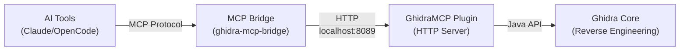

# Ghidra Component

Installs Ghidra reverse engineering platform with the GhidraMCP plugin pre-installed.

## What's Included

- **Ghidra** (wrapped with Python) - NSA's reverse engineering framework
  - Uses `symlinkJoin` to wrap binaries with Python in PATH
  - PyGhidra scripts work without additional setup
- **GhidraMCP Plugin** - HTTP server that exposes Ghidra capabilities for AI tools

The plugin extension is automatically installed to `~/.ghidra/.ghidra_<version>_PUBLIC/Extensions/`.

### Python Support

All Ghidra shell scripts are wrapped with Python in PATH using `makeWrapper`. 

**Important**: Regular `ghidra` uses Jython (Java-based Python), not CPython. 

To use CPython scripts (like `GolangFindDynamicStrings.py`):

```bash
# Launch Ghidra with PyGhidra (CPython support) - launches GUI in background
ghidra-pyghidra

# Launch with console attached (useful for debugging)
ghidra-pyghidra --console

# Or use the regular Jython-based Ghidra
ghidra
```

**Note**: `ghidra-pyghidra` launches the GUI in the background by default and exits immediately. Use `--console` to keep the terminal attached and see output.

### Troubleshooting PyGhidra

If you get tkinter errors, you may need to recreate the PyGhidra venv:

```bash
rm -rf ~/Library/ghidra/ghidra_12.0.2_NIX/venv
ghidra-pyghidra --console
```

The wrapper provides Python with tkinter support, and PyGhidra will create a fresh venv that can access it.

## Usage

### First Time Setup

1. Start Ghidra
2. **Important:** Restart Ghidra to load the new extension
3. Open a CodeBrowser window
4. Enable the plugin:
   - Go to **File > Configure > Configure All Plugins**
   - Check the box for **GhidraMCP**
   - Click OK
5. Start the HTTP server:
   - Go to **Tools > GhidraMCP > Start MCP Server**
   - Server will run on `http://127.0.0.1:8089`

### Verify It's Working

```bash
curl http://127.0.0.1:8089/check_connection
# Should return: "Connected: GhidraMCP plugin running with program '<name>'"
```

## Using with MCP Bridge

The Python MCP bridge is installed separately (see `system/*/user/*/default.nix`).

Once Ghidra is running with the plugin HTTP server started:

```bash
ghidra-mcp-bridge
```

This connects AI tools to Ghidra's 193 reverse engineering capabilities via MCP protocol.

## Configuration

Optional: Configure custom HTTP port via:
- **CodeBrowser > Edit > Tool Options > GhidraMCP HTTP Server**

## Setup Notes

After installation, you need to:
1. Start Ghidra
2. **Restart Ghidra** to load the newly installed plugin extension
3. Enable the plugin via **File > Configure > Configure All Plugins > GhidraMCP**
4. Start the HTTP server via **Tools > GhidraMCP > Start MCP Server**

The server will then be available at `http://127.0.0.1:8089`.

## Architecture



## Plugin Updates

When the GhidraMCP plugin is updated:
1. Home-manager will update the extension file automatically
2. Restart Ghidra to load the new version

## Version Compatibility

The plugin is built for the version of Ghidra in nixpkgs (currently 12.0.2).
Both are updated together when you rebuild your configuration.
