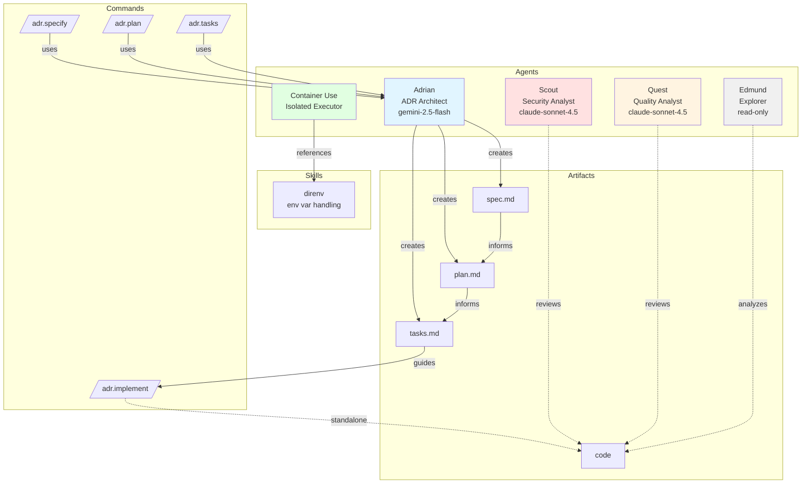

# OpenCode Configuration

This configuration defines the behavior of the OpenCode AI assistant.

## Architecture

## Components

### Agents

Defined in `agent/*.md` with model, permissions, and tool access:

- **Adrian** - ADR architect (gemini-2.5-flash, no bash, planning only)
- **Scout** - Security analyst (claude-sonnet-4.5, full access)
- **Quest** - Quality analyst (claude-sonnet-4.5, full access)
- **Edmund** - Read-only explorer (no edit/bash/webfetch)
- **Container Use** - Isolated environment executor (container-use tools only)

### Commands

Workflows in `commands/` that trigger agents:

- `/adr.specify` → Adrian (creates spec.md)
- `/adr.plan` → Adrian (creates plan.md)
- `/adr.tasks` → Adrian (creates tasks.md)
- `/adr.implement` → general agent (executes tasks)

### Skills

Procedural knowledge in `skills/`:

- **direnv** - Environment variable handling guidance